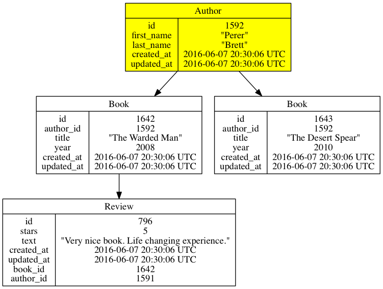

# Active Explorer

Active Explorer is a Ruby gem for visualization of run-time data and associations represented by Active Record.

**NOTE: Only Active Record 4.2.x is currently supported. More versions comming next week. Come back soon ;)** 

**NOTE: This is pre-alpha version. Many things might change.** 

How the gem works? It simply looks for `has_many`, `has_one` and `belongs_to` associations 
and traverse through them to associated objects. Then it does the same with them until it explores all the surroundings.

It then prints nice graph represantation:

- to image file or
- to console

One picture is worth a thousand words:



And the same objects in console output:

```ruby
Author(1592) {:first_name=>"Perer", :last_name=>"Brett"}
  -> has Book(1642) {:author_id=>1592, :title=>"The Warded Man", :year=>2008}
      -> has Review(796) {:stars=>5, :text=>"Very nice book. Life changing experience.", :book_id=>1642}
  -> has Book(1643) {:author_id=>1592, :title=>"The Desert Spear", :year=>2010}
```

## Installation

Add this line to your application's Gemfile:

```ruby
gem 'active_explorer'
```

And then execute:

```
$ bundle
```

Or install it yourself as:

```
$ gem install active_explorer
```

## Usage

In Rails, place this code into `application.rb`:

```ruby
require "active_explorer"
```

Call:

```ruby
ex my_object # Prints output to console
exf my_object # Prints output as a graph to image file
```

Note: `ex` is abbreviation for `explore` and `exf` for `explore_to_file` methods.

See [Examples](#examples) (or test cases) for more examples.

## Configuration

### Parameters

Only `exf` has:

```ruby
file_name = nil # When not specified, gem will create file composed of "object class" and "object id", e.g. "book_12.png"
```

Both `ex` and `exf` have: 

```ruby
class_filter: nil,          # Allowed or ignored classes 
attribute_filter: nil,      # Attributes to be displayed (per class setting)
attribute_limit: nil,       # First "n" attributes to be displayed
association_filter: nil,    # Which direction to explore (parents, children, all)?
depth: 5                    # Recursion depth at which to stop
```

Example:

```ruby
ex Author.first, class_filter: [:books, :reviews],          
               attribute_filter: { books: [:id, :title], reviews: [:id, :text] }, 
               association_filter: [:has_many], 
               attribute_limit: 5,
               depth: 10
```

Important: Use **plural form** of your classes.

See [Examples](#examples) (or test cases) see exact usage.

Check [Global Configuration](#global-configuration) to easily set this filter once for all future calls.

### Global Configuration

Place this to initializer. E.g. `initializers/active_explorer.rb`:

```ruby
ActiveExplorer::Config.class_filter = {ignore: [:reviews]}
ActiveExplorer::Config.attribute_limit = 5
ActiveExplorer::Config.depth = 10
```

This configuration will be applied for every call of `ex` or `exf` as if respective parameters were added to the call.

## Examples

All examples assume following data and associations:

```ruby
Author(1) {:first_name=>"Perer", :last_name=>"Brett"}
  -> has Book(1) {:author_id=>1, :title=>"The Warded Man", :year=>2008}
      -> has Review(1) {:stars=>5, :text=>"Very nice book. Life changing experience.", :book_id=>1}
  -> has Book(2) {:author_id=>1, :title=>"The Desert Spear", :year=>2010}
```

### Output to Console

Use `ex` to print text output to Console.

```ruby
ex Book.first
```

Use this in code or in IRB / Rails Console.

### Output to Image

Use `exf` to print output as a nice graph to image file. Following command generates file `book_1.png` (for Book with id: 1).

```ruby
exf Book.first
```

Use this in code or in IRB / Rails Console.

### Class Filter

#### Show

Show only classes that you want.

```ruby
ex Author.first, class_filter: [:books]
```

This will only display Author (as a root) and objects of Book class. Processing stops with Book classes and does not go further to parents or children.

Alternative notation using `show` parameter.

```ruby
ex Author.first, class_filter: { show: [:books] }
```

#### Ignore

```ruby
ex Author.first, class_filter: { ignore: [:reviews] }
```

### Attribute Filter

For any class you can specify list of attributes that will be displayed.

```ruby
ex Author.first, attribute_filter: { books: [:id, :title], reviews: [:id] }
```

### Attribute Limit

Set limit to show just first couple of attributes. This is useful when your classes contain many attributes and final output gets too big (especially image output). When you do not need all attributes to be displayed, this is fastest way to make output much nicer.

```ruby
ex Author.first, attribute_limit: 3
```

### Association Filter

By default, the gem follows two ways:

- finds objects associated by `belongs_to` and continues to look only for `belongs_to` associations of these objects (recursively for all subobjects) 
- finds objects associated by `has_many` / `has_one` and continues to look only for `has_many` / `has_one` associations of these objects (recursively for all subobjects) 

You can change the default configuration by specifying array containing some of possible values: `:has_many`, `:has_one`, `:belongs_to`, `:all`.

Value `:all` means that for each explored object the exploration continues in both `has_xxx` and `belongs_to` directions.

```ruby
ex Book.first, association_filter: [:has_many]
```

This will explore only the "down" way (through children) of Book object.

## Development

After checking out the repo, run `bin/setup` to install dependencies. Then, run `rspec` to run the tests. You can also run `bin/console` for an interactive prompt that will allow you to experiment.

To install this gem onto your local machine, run `bundle exec rake install`. To release a new version, update the version number in `version.rb`, and then run `bundle exec rake release`, which will create a git tag for the version, push git commits and tags, and push the `.gem` file to [rubygems.org](https://rubygems.org).

## TODO

- Bug hunt.
- Support all versions of Active Record >= 3.0.x
- Export to yuml.me graphing website.
- Interactive graph.
- Rubymine plugin ;)

## Known Issues

### Timeout in Debugger

When calling `exf` during debugging session in Rubymine, gem returns timeout error. Apart from this message everything works. The image gets saved and it is saved far before the timeout appears.

It seems that it has something to do with Ruby GraphViz gem.

If you have any hint on this please contact me.

## Contributing

Bug reports and pull requests are welcome on GitHub at https://github.com/rascasone/active_explorer. This project is intended to be a safe, welcoming space for collaboration, and contributors are expected to adhere to the [Contributor Covenant](contributor-covenant.org) code of conduct.


## License

The gem is available as open source under the terms of the [MIT License](http://opensource.org/licenses/MIT).

